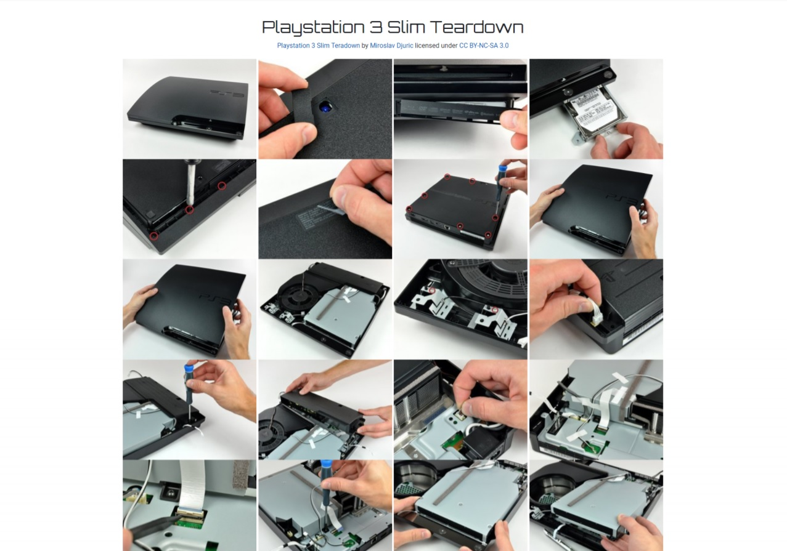

# Milestone Project 1

---

## Pro Solutions

This project is a summary of learning of the three modules of the Full Stack Developer Cours - HTML, CSS, User Centric Frontend Development, the aim of which was to create a mobile, fully responsive website. This responsive website was created for the "Pro Solutions" video game console service, which I do as my hobby.

Thanks to this website, people interested in repairing their consoles will have the opportunity to familiarize themselves with the services, prices and will be able to contact the service directly for advice via the contact form.

## Table of contents

- <a href="#project">Project Construction 👷</a>
- <a href="#ux">User Experience Design 🧠</a>
- <a href="#tech">Technologies Used 🔨</a>
- <a href="#features">Features List 😲</a>
- <a href="#testing">Testing 🔥</a>
- <a href="#deployment">Deployment 🚀</a>
- <a href="#credits">Credits 🙏</a>

---

## 1️⃣ Project Construction 👷

This project uses the Bootstrap Framework to create a multi-page, fully responsive website with a mobile-first approach. The project is fully compliant with the requirements set by Code Institute, to create website using HTML, CSS and bootstrap framework.

Despite the above, the website contains two forms with very simple java-script that after submit will confirm submit and reset the form.

As my skill level grows, the functionality of the website will evolve to include java script features, back-end features and online payments. Then it can be used for commercial purposes.

<a href="#top">Back to top ⬆️</a>

## 2️⃣ User Experience Design 🧠

### To whom the website is addressed❓

The main target of the website are people who are looking for a game console repair service for repair or consultation.

### What the visitors expect❓

The main reasons for visiting service website are:

- 👓 To see what the service offer.

- 💰 To check prices for a repair.

- 📞 To contact the service.

- 📓 To book a service.

### Why does my website meet these requirements❓

- 👓 The main page presents and illustrates what repairs are carried out by the service. Encourage to cooperate and presents customer reviews.

- 💰 It is very easy to find the page with prices and a brief description of the repair using the navbar Price tab or the large button visible on the main page.

- 📞 There is a lot of informations on how to contact the service. From number, email, social links at the top of the page, addres in the footer and the Contact page with map and contact form.

- 📓 The service can be booked via the Repair Order button located in the footer on each page.

### Wireframes:

- <a href="assets/readmeimages/desktopwireframes.pdf" target="_blank">Desktop wireframes</a>
- <a href="assets/readmeimages/tabletwireframes.pdf" target="_blank">Tablet wireframes</a>
- <a href="assets/readmeimages/mobilewireframes.pdf" target="_blank">Mobile wireframes</a>

<a href="#top">Back to top ⬆️</a>

## 3️⃣ Technologies Used 🔨

- HTML - Standard markup language for documents designed to be displayed in a web browser.

- CSS - Describes how HTML elements are to be displayed on screen, paper, or in other media.

- <a href="https://getbootstrap.com/" rel="noopener" target="_blank">Bootstrap</a> - Potent front-end framework used to create modern websites and web apps.

- <a href="https://www.gitpod.io/" rel="noopener" target="_blank">Gitpod</a> - An online IDE which can be launched from any GitHub page

- <a href="https://github.com/" rel="noopener" target="_blank">GitHub</a> -A Git repository hosting service

- Google Chrome Dev Tools - A set of web developer tools built directly into the Google Chrome browser.

- <a href="https://www.bootstrapcdn.com/" rel="noopener" target="_blank">Javascript / JQuery</a> - For the Modal and Responsive Navbar expand and collapse functionality.

- <a href="https://michalsnik.github.io/aos/" rel="noopener" target="_blank">Animate On Scroll</a> - The AOS library developed by Michal Sajnóg

- <a href="https://fancyapps.com/fancybox/3/" rel="noopener" target="_blank">Fancybox3</a> - JavaScript lightbox library for presenting various types of media.
  Responsive, touch-enabled and customizable.

- <a href="https://fontawesome.com/" rel="noopener" target="_blank">Font Awesome</a> - A web font containing all the icons from the Twitter Bootstrap framework, and now many more.

- <a href="https://fonts.google.com/" rel="noopener" target="_blank">Google Fonts</a> - A library of 999 free licensed font families.

- <a href="https://www.google.com/maps/@53.3900981,-6.2363592,14z" rel="noopener" target="_blank">Google Maps</a> - For embedding google map location.

- <a href="balsamiq.com" rel="noopener" target="_blank">Balsamiq</a> - Wireframing tool.

<a href="#top">Back to top ⬆️</a>

## 4️⃣ Features List 😲

### Header and Nav bar

Both elements are fixed on top on all pages. Header provide mobile number with email and social access. Navigation provides easy access to website content at all times.

### Footer

It's located on the bottom of every page. It contains contact information, direct links to service for each console and button taking to repair order form.

### Home page

- Service section

It contains a description of what the service does and presents it using icons and short description. It also includes a button that takes to a page with repair descriptions and prices.

- Attributes section

This section contains attributes that encourage to choose a service.

- Quotes section

The user quotes section allow to learn more about Pro Solutions from trustworthy sources, by reading quotes from existing costumers.

### Prices page

This page allows to check services and prices for each console.

### Gallery page

This page shows an example Playstation 3 console teardown and presents it in nice Fancybox3 gallery.

### Contact page

This page allows to contact the service by filling contact form. It also includes google maps location.

<a href="#top">Back to top ⬆️</a>

## 5️⃣ Testing 🔥

I have personally tested the website on several devices and browsers. As the main test tool I used <a href="https://developers.google.com/web/tools/chrome-devtools" rel="noopener" target="_blank">**Chrome DevTools**</a> including <a href="https://developers.google.com/web/tools/lighthouse" rel="noopener" target="_blank">Lighthouse</a> to see how website performes and it helped to improve user experience. Other tests:

### Navigation

1. Visited website on multiple devices and browsers to make sure navbar is visible and fixed on top.
2. Checked on mobile device if navigation toggle icon works properly.
3. Checked if hover works properly.
4. Checked all links if they open correct page.

### Icons

1. Visited website on multiple devices and browsers to make sure icons are visible.
2. Checked if hover works properly.
3. Checked if bootstrap tooltip works properly on social media icons.
4. Checked social media icons if they open in new tab.

### Buttons

1. Visited website on multiple devices and browsers to make sure bootons are properly visible.
2. Checked if hover works properly.
3. checked if Service and Prices button direct to correct page.
4. Checked if Repair Order button direct to modal form.
5. Checked if Submit button works properly.

### Animation On Scroll

1. Visited website on multiple devices and browsers to make sure animations work properly.
2. Checked duration and offset.

### Fancybox3 gallery

1. Visited website on multiple devices and browsers to make sure gallery works properly.
2. Checked all pictures if they display properly.

### Forms

1. Visited website on multiple devices and browsers to make sure forms work properly.
2. Attempted to fill out contact form while leaving a required field blank.
3. Checked if java-script is working after pressing submit button.

### W3C CSS test:

1. Visited W3C CSS Validator.
2. Uploaded the entire stylesheet.
3. Made all corrections to repair errors.

### W3C HTML test:

1. Visited W3C HTML Validator.
2. Uploaded all contents for each html page.
3. Made all corrections to repair errors.

I did not notice any problems with the operation of the website on any of my devices or browsers. However, taking into account my experience, I cannot say that the website is error-free.

<a href="#top">Back to top ⬆️</a>

## 6️⃣ Deployment 🚀

Project was started from Code Institute <a href="https://github.com/Code-Institute-Org/gitpod-full-template">gitpod-full-template</a> and developed using Gitpod’s IDE. All developments were pushed to the corresponding repository in GitHub account.

In order to deploy the website to Github pages, I:

- Selected the Repository from the Github Dashboard.

- Navigated to "Settings" then "Github Pages".

- Selected "master branch" in Source section.

- Page auto refreshed and link generated under Github Pages section:

  👉 Your site is published at https://zokam1411.github.io/milestone-project-1/

### To run this project locally:

- Select the Repository from the Github Dashboard.

- Click the green button labeled 'Code'.

- Click 'Download ZIP'.

- Extract ZIP file on your computer.

- Open folder and open index.html in web browser.

### To clone this project:

- Select the Repository from the Github Dashboard.

- Click the green button labeled 'Code'.

- To clone the repository using:
    - HTTPS: under "Clone with HTTPS", click checklist icon.
    - SSH: click Use SSH, then click checklist icon.

- Open Git Bash.

- Change the current working directory to the location where you want the cloned directory.

- Type 'git clone', and then paste the URL you copied earlier.

- Press Enter to create your local clone.

<a href="#top">Back to top ⬆️</a>

## 7️⃣ Credits 🙏

### Media content:

- Hero images on gallery and contact page: <a href="https://unsplash.com/" rel="noopener" target="_blank">Unsplash</a> (licence free images)
- Gallery images: <a href="https://www.ifixit.com/" rel="noopener" target="_blank">Ifixit</a> (iFixit content is licensed under the Creative Commons BY-NC-SA 3.0 license.)
- Consoles images on prices page: <a href="https://www.cleanpng.com/" rel="noopener" target="_blank">CleanPNG</a> (licence free images)
- Icons <a href="https://fontawesome.com/" rel="noopener" target="_blank">Font Awesome</a>

### Acknowledgments:

- <a href="https://codeinstitute.net" rel="noopener" target="_blank">Code Institute</a>
- <a href="https://stackoverflow.com/" rel="noopener" target="_blank">Stack Overflow</a>
- Code Institute Slack Comminity.
- My mentor Guido Cecilio for guidance and support.
- My family and friends for their patience and honest critique throughout.

<a href="#top">Back to top ⬆️</a>

